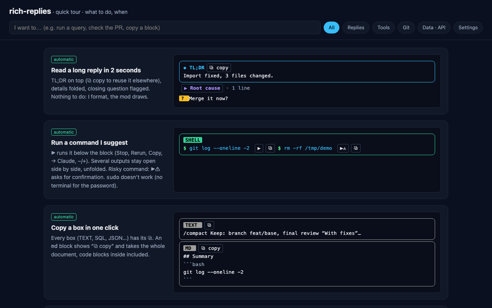

# rich-replies

**Claude Code replies and tool calls you can act on, right in the terminal.**

A Claude Code mod that adds structure to the transcript: a TL;DR box on long replies, ▶ to run a suggested command, the error that matters under a failed tool call, a read-only SQL console, and `/changes` to stage a diff hunk by hunk. Every feature is **off** until you turn it on.



## Quick start

Requires Claude Code 2.1.287 or newer (mods API).

```text
/plugin marketplace add bourafai/rich-replies
/plugin install rich-replies@rich-replies
```

Create `~/.claude/rich-replies.jsonc` with a starter set:

```jsonc
{
  "features": {
    "tldr": true, "details": true, "questions": true,
    "codeBlocks": true, "shellBlocks": true, "run": true,
    "toolHeaders": true, "errorLens": true, "stackLinks": true
  }
}
```

Send your next prompt: the features apply right away. To try everything in a sandbox, ask Claude **"how do I use rich replies"**. The bundled `rich-replies-tour` skill walks you through each feature, one step at a time.

Buttons (⧉, ▶, → Claude) answer clicks on desktop, and in the terminal in fullscreen mode (`/tui fullscreen`, back with `/tui default`).

## Features

| Key | What you get | Needs |
| --- | --- | --- |
| `tldr`, `details`, `questions` | ◆ TL;DR box with ⧉ copy, ▶ foldable sections, a `?` badge on the closing question | |
| `codeBlocks` | Framed code with a language badge and ⧉ copy (an `md` block copies the whole document) | |
| `shellBlocks` | Framed shell blocks with ⧉ copy | |
| `run` | ▶ runs a command under its block, several runs side by side; risky commands (delete, push, upload, `\| sh`, non-GET requests) ask for a second click | `shellBlocks` |
| `links` | Bare URLs become short links; a PR reads `⎇ repo #367` | |
| `colorSwatches` | A ██ swatch before each color a reply names | |
| `imagePreview` | Thumbnails of image paths a reply cites | Image-capable terminal (iTerm2, Kitty, Orca), macOS |
| `toolHeaders` | Badges and durations on tool rows | |
| `errorLens`, `stackLinks` | The error line that matters under a failed call, `↗ file:line` links that open your editor | |
| `problems` | Lint results on the row right after an Edit or Write | The repository's `phpcs` / `eslint`, or `php -l`, `node --check`… |
| `sqlConsole` | ▶ on ```` ```sql ```` blocks: read-only, 50 rows; a `DELETE` / `UPDATE` is simulated (the rows it would touch, nothing written) | `codeBlocks`; MariaDB on `127.0.0.1:3306`, a `mariadb` or `mysql` client |
| `restClient` | ▶ on a `curl` line: status, time, size, headers, body | `shellBlocks`, `run` |
| `jsonViewer` | A foldable 🌳 tree for JSON blocks, REST bodies and `/exec` output | `codeBlocks` (blocks), `restClient` (bodies) |
| `changesCommand` | `/changes`: the unstaged diff hunk by hunk: stage, unstage, revert, restore, → Claude | `git` |
| `prCommand` | `/pr`: a live card for the branch's PR, CI checks, a failing log → Claude | `gh` |
| `execCommand` | `/exec <command>`: runs it in the transcript; Claude sees the output only when you click → Claude | |

Commands (`/changes`, `/pr`, `/exec`) register when the plugin loads: after turning one on, run `/reload-plugins`.

A visual cheat sheet of every feature lives in [`docs/rich-replies/index.html`](docs/rich-replies/index.html) (open it locally).

## Configuration

`~/.claude/rich-replies.jsonc` has four sections. The commented [example](hooks/rich-replies/rich-replies.example.jsonc) documents each key; copy it to start from all of them:

```bash
cp ~/.claude/plugins/marketplaces/rich-replies/hooks/rich-replies/rich-replies.example.jsonc ~/.claude/rich-replies.jsonc
```

- `features`: `true` / `false` per feature.
- `palette` and `colors`: name your colors once (`#rrggbb`), then use them by name.
- `editor`: the CLI that stack links open with (`cursor`, `code`).

A wrong key or value shows a toast and keeps its default. With `NO_COLOR` set, the mod draws nothing of its own and adds no formatting guide; enabled commands and the `problems` linter still run.

## Security

- `run`, `restClient` and `sqlConsole` execute what a reply suggests, **on your click only**.
- The SQL console reads only: one statement, inside a `READ ONLY` transaction. Client commands, executable comments, `LOAD_FILE` and `INTO OUTFILE` are refused.
- `problems` runs the repository's own linters (`vendor/bin/phpcs`, `node_modules/.bin/eslint`): enable it on repositories you trust.
- `sudo` does not work with ▶: the password prompt has no terminal. Run those commands in a real terminal.

## Alongside other mods

rich-replies is one plugin among others, and nests with them in either order. To add your own rows under tool rows (a job's live steps, say), write your own plugin whose `ui.render` hook on `ToolUse` wraps `await next(e)` and adds rows under it. When a plugin beneath rich-replies changes a tool row or rewrites a reply's text, rich-replies keeps that change.

## Development

```bash
claude plugin validate .
claude plugin test .
```

The mod lives in `hooks/rich-replies/`: `register.tsx` holds the hooks, `parse.ts` the pure logic, which the tests in `tests/` cover. Issues and pull requests are welcome.

## License

[MIT](LICENSE)
